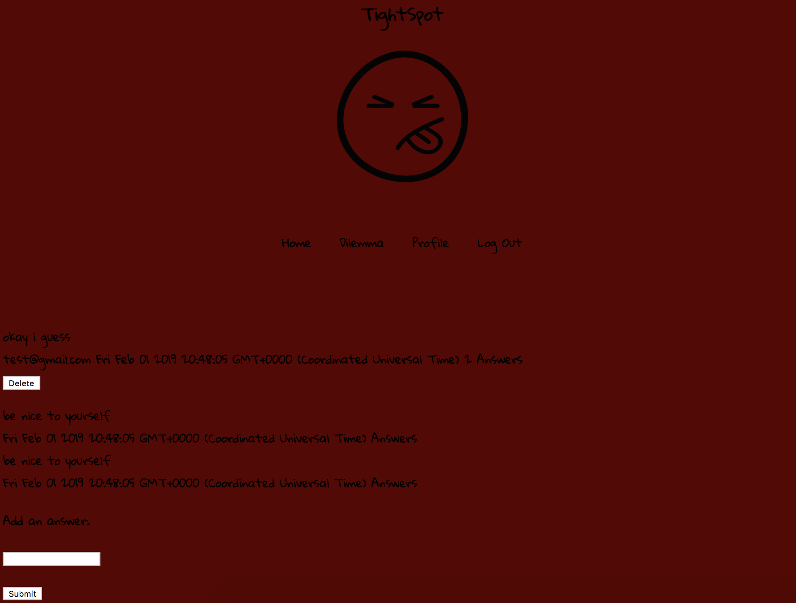

# TightSpot

## Description
Tight Spot is an app where users can compose "dilemmas" and post them to a public feed. After a user posts their dilemma, other users can add answers. This app was designed to be a place for people to let the world know about dilemmas they may have and get real world suggestions and advice from others on what to do about them.

## Example

## Features
- Users have the option to delete dilemmas they have posted 
- Other users can add "answers" to dilemmas
- Each dilemma displays the date and time it was created, the number of answers it currently has, the users username, and the actual dilemma
- When logged in, a user can navigate to 4 places. Those places include the homepage, a page to create a new dilemma, their profile page, and lastly log out
- If a user is not logged in they only have access to the homepage and the log in and sign up buttons 

## Used 
- Node
- Express
- Handlebars
- CSS
- HTML
- Javascript

## Installed dependencies 

- Handlebars 
- Node 
- Mongoose 
- Express 

## App Improvements

- CSS Styling 
- More functionality and features 
